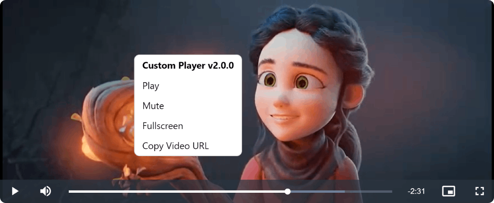

# Video.js Context Menu Plugin

The Video.js Context Menu Plugin enhances your Video.js player by providing a customizable context menu that appears when users right-click on the video player. This context menu includes various options, such as play/pause, mute/unmute, fullscreen, and copy video URL.




## Compatibility

This plugin version is compatible with Video.js v8.x.

## Getting Started

### Prerequisites

Make sure you have [Video.js](https://videojs.com/) installed in your project before using this plugin.

### Installation

Include the Video.js library and the `videojs-context-menu` files in your HTML file:

```html
<!-- Video.js library -->
<link href="https://vjs.zencdn.net/8.6.1/video-js.css" rel="stylesheet"/>
<script src="https://vjs.zencdn.net/8.6.1/video.min.js"></script>

<!-- Video.js Context Menu plugin -->
<link href="https://cdn.jsdelivr.net/gh/Teyuto/videojs-context-menu@main/src/videojs-context-menu.min.css" rel="stylesheet"/>
<script src="https://cdn.jsdelivr.net/gh/Teyuto/videojs-context-menu@main/src/videojs-context-menu.min.js"></script>
```

### Usage

Initialize Video.js as you normally would and add the Video.js Context Menu:

```javascript
// Create a video player
var player = videojs('my-video');

// Add Video.js Context Menu Plugin
player.contextmenu({
  playerName: 'Custom Player',
  playerVersion: '2.0.0',
  playerUrl: 'https://example.com/player',
  theme: 'dark',
  buttons: ['playPause', 'muteUnmute', 'fullscreen', 'copyUrl']
});
```

Make sure to replace `'my-video'` with your actual video player ID.

## Options

You can customize the context menu appearance and behavior using the following options:

- `playerName`: The name of your video player.
- `playerVersion`: The version of your video player.
- `playerUrl`: The URL to your video player.
- `theme`: The theme of the context menu ('light' or 'dark').
- `buttons`: An array of buttons to include in the context menu. Possible values are 'playPause', 'muteUnmute', 'fullscreen', and 'copyUrl'.

## Example
Check the provided HTML `examples/index.html` file for a working example.

## License

This project is licensed under the MIT License - see the [LICENSE.md](LICENSE.md) file for details.

---